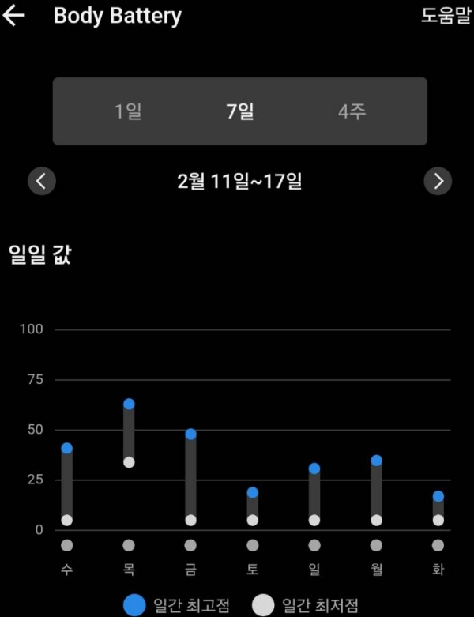
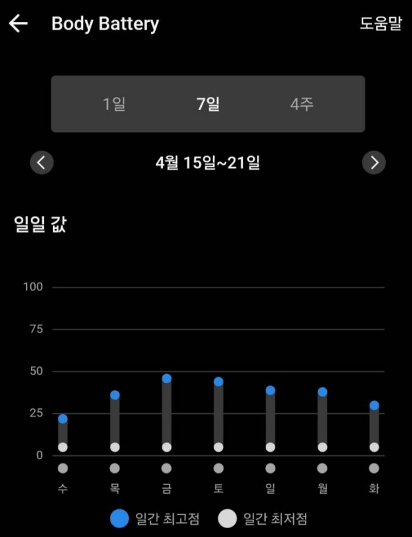
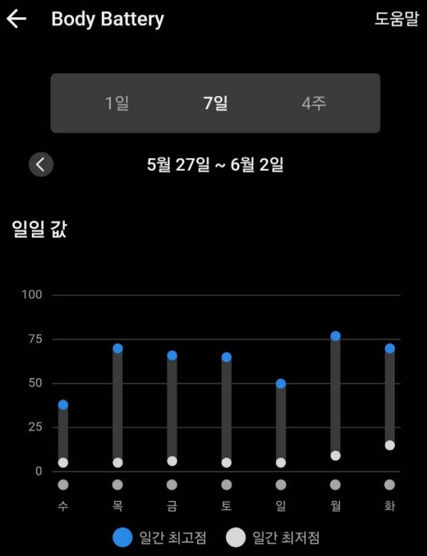

i started going back to the office last september.
after years of burnout, i was convinced that stopping — even for one day —
would drag me back to the version of myself that couldn't get moving.

so i didn't stop.

learner's license. never really drove until then.
subway. bike, 3–4 times a week.
weekends. holidays. three weeks straight at one point.

every day i logged the hours.
"why can i only last 6 hours."
"i should be doing 8."

i wasn't rebuilding.
i was outrunning something.

---

april 15th. shingles.
three days before the JustDoc launch.

i took one day off. then went straight back.
seven days in a row.

a few days later — couldn't walk from the dining table to the couch
without losing my breath.
lying still felt wrong.
heart rate was normal. tests were normal.
but i knew.

that was the first time i couldn't convince myself to push through it.

so i stopped. not because i wanted to.
because i had no choice.

---

that week changed something.

i started going to bed before midnight.
turns out the difference between 11:50 PM and 12:30 AM
is bigger than it sounds.

i stopped measuring myself by hours at the office.
some days 3. some days 5.
and strangely, i can do more now than i could back then.
not because i'm pushing harder.
because i'm recovering better.

---

february.
body battery hitting 5 by mid-afternoon.
some days by 5pm. some days earlier.
starting the day half-empty and finishing it completely drained.
most mornings never got much above 30.

  
  
  

june.
still 6–8 right before bed.
peaks hitting 70–77.

same person.
different relationship with recovery.

---

i still watch myself.
the moment i feel better, i want to hit the accelerator.
that's probably never going away.

so i keep checking the body battery.
not for the score.
because burnout doesn't arrive overnight.
it sends warnings long before it shows up.

last time, i ignored them.
this time, i'm trying to listen.

---

p.s.
i've always been obsessed with data.
not because i love numbers.
because i love patterns.
numbers. timelines. trends.
collect it. structure it. find the pattern.
i've been doing that for as long as i can remember.
that's probably why i built jaycalendar.
that's probably why justdoc exists.
and it's probably why i can't stop checking the body battery.
same instinct.
different data.
